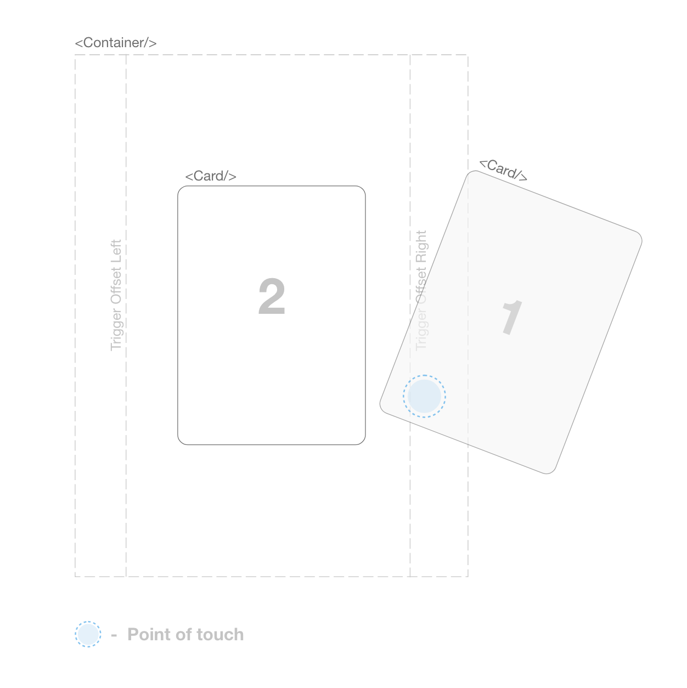

# re-swipe

## Introduction

re-swipe is a react component library emulating the UI card swipe as seen on applications such as tinder, this component provides the state track for each card, controls for physic's animation, dynamic trigger, and other feature's.

<p align="left" >
  
    
</p>

## Basic Usage

```js
import React, { Component } from "react";
import ReContainer, { ReCard } from "re-swipe";

class App extends Component{
    constructor(props){
        super(props);
        this.state={

        }
    }

    render(){
        return(
            <ReContainer>
                <ReCard></ReCard>
            </ReContainer>
        )
    }
}

```

## API

`<ReContainer>`

| Prop          | Description   | Type  | Default Value | Expected Values |
| ------------- |:-------------|:-----:|:-----|:-----|
| mass          | Provide the mass for animation.            | Float | 0.7 | 0.1 - 1 |
| damping       | Provide the damping for animation.         | Float | 0.8 | 0.1 - 2|
| width         | The width for parent container  | Int      | 300 | -  | 
| height        | The height for parent container | Int      | 500 | -  |
| offset        | The offset trigger areas on left and right | Int | 10 | 5 - 40 |

`<ReCard>`

| Prop          | Description   | Type  | Default Value |
| ------------- |:-------------|:-----:|:-----|
| width         | Provide the width of the child component  | Int | 300 |
| height        | Provide the height of the child component | Int | 400 |

## How does it work

It consist of two components `<ReContainer/>` and the `<ReCard/>`, the `<ReContainer/>` component is used to keep track of each card component 
being swipped left and right. By default the `<ReContainer/>` component only 
render's 4 cards component only for better animation and performace. Each 
`<Card/>` component has to be provided width a callback function which is
used to return o the state of the card when swiped to the left or swiped
to the right.

The `<ReContainer>` take's the `offset` prop which is by default set to 10,
the `offset` will be used to check if the point of contact with a `<Card/>`
component is under the offset area which will trigger the swipe mechanism.

<p align="center" >
  
</p>

## Demo

## License

MIT

